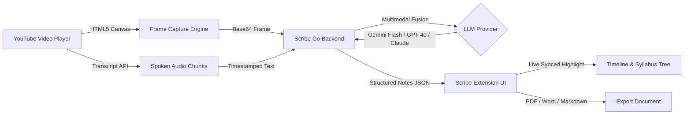

# 🖋️ Scribe — Multimodal AI Video Note Engine

> **Turn any technical YouTube tutorial or lecture into structured, clean developer notes with live screen vision and audio transcript synthesis.**

[](https://go.dev/)
[](https://react.dev/)
[](https://www.typescriptlang.org/)
[](LICENSE)
[](backend/Dockerfile)

---

## 🌟 Overview

**Scribe** is an intelligent browser extension (Chrome Manifest V3) paired with a lightweight, high-performance Go backend. While you watch coding tutorials, university lectures, or technical presentations on YouTube, Scribe automatically watches alongside you:

1. **🎙️ Spoken Audio**: Parses spoken concepts from YouTube captions and timing windows.
2. **🖥️ Visual Screen Analysis**: Captures slide diagrams, terminal code, and architecture diagrams.
3. **🧠 Multimodal Fusion**: Merges what the instructor said with what is on screen into structured takeaways, numbered key points, and runnable code blocks.
4. **📄 Export Anywhere**: Download study notes instantly as **PDF Documents**, **Microsoft Word (`.doc`)**, or **Markdown (`.md`)**.

---

## 🏗️ Architecture Pipeline



---

## ✨ Features

- **🌓 Minimal Dark & Light Mode**: Deep pure black (`#09090b`) theme designed for developers, with a crisp light theme toggle.
- **🎵 Synced Playback Active Highlighting**: Notes glow with an indigo accent indicator in real-time as the video timestamp matches the note.
- **🎯 In-Video Floating Quick Capture (`Alt+N`)**: Spotlight overlay centered over the video canvas for instant note taking without leaving theater/fullscreen mode.
- **💬 Interactive AI Command Bar**: Type *"Summarize slide on screen"* or *"Extract algorithm steps"* to query Gemini / GPT-4o live on current video context.
- **🗂️ Dual View Modes**:
  - **`Timeline`**: Chronological stream with source badges (💬 *spoken*, 🖥️ *screen*, ✍️ *manual*, ✨ *ai*).
  - **`Syllabus Tree`**: Hierarchical chapter outline with collapsible sections.
- **📱 Redesigned Extension Popup**: Detects active YouTube video, tracks recent watch history, and provides one-click navigation.
- **🛡️ Built-in Cost Protection & Rate Limiting**: In-memory token bucket rate limiter (30 req/min) and session frame guard (50 frames/video cap) to prevent runaway API billing.

---

## 🚀 Quickstart Guide

### 1. Prerequisites
- [Go 1.21+](https://go.dev/dl/)
- [Node.js 18+](https://nodejs.org/) & `npm`
- Google Gemini API Key (Free tier available at [Google AI Studio](https://aistudio.google.com/)) or OpenAI / Anthropic key.

---

### 2. Backend Setup

```bash
# 1. Navigate to backend directory
cd backend

# 2. Copy environment template
cp .env.example .env

# 3. Add your API key in .env
# GEMINI_API_KEY=your_key_here
# LLM_PROVIDER=gemini
# MODEL_NAME=gemini-flash-latest

# 4. Run tests
go test -v ./...

# 5. Start server
go run main.go
```
The server will start on `http://localhost:8080`.

---

### 3. Extension Setup

```bash
# 1. Navigate to extension directory
cd extension

# 2. Install dependencies
npm install

# 3. Build extension
npm run build
```

#### Load Unpacked Extension in Chrome:
1. Open Google Chrome and navigate to `chrome://extensions/`.
2. Enable **Developer mode** (toggle in the top-right corner).
3. Click **Load unpacked**.
4. Select the `extension/dist` folder.
5. Open any [YouTube Video](https://www.youtube.com/) to start taking notes!

---

## 🐳 Docker & Cloud Deployment

### Run with Docker

```bash
# Build Docker image
docker build -t scribe-backend ./backend

# Run container
docker run -p 8080:8080 -e GEMINI_API_KEY=your_key_here scribe-backend
```

### Deploy to Render / Railway

- **Render**: Connect repository and deploy using included [`render.yaml`](render.yaml).
- **Railway**: Deploy using [`railway.json`](railway.json) with 1-click Docker build.

> When hosted in the cloud, update the backend URL inside the extension Settings modal or build with `VITE_BACKEND_URL=https://your-hosted-backend.com npm run build`.

---

## ⚙️ Environment Variables Reference

| Variable | Default | Description |
| :--- | :--- | :--- |
| `PORT` | `8080` | HTTP server port |
| `LLM_PROVIDER` | `gemini` | Active provider (`gemini`, `openai`, `claude`, `mock`) |
| `GEMINI_API_KEY` | `""` | Google Gemini API Key |
| `MODEL_NAME` | `gemini-flash-latest` | Model identifier |
| `OPENAI_API_KEY` | `""` | OpenAI API Key (if using OpenAI) |
| `ANTHROPIC_API_KEY`| `""` | Anthropic API Key (if using Claude) |
| `RATE_LIMIT_RPM` | `30` | Max requests per minute per client IP |
| `MAX_FRAMES_PER_SESSION` | `50` | Max visual frames analyzed per video session |
| `ALLOWED_ORIGINS` | `*` | CORS allowed origins |

---

## ⌨️ Keyboard Shortcuts

| Shortcut | Action |
| :--- | :--- |
| **`Alt + S`** (or `Ctrl+Shift+S`) | Toggle Scribe Sidebar Drawer |
| **`Alt + N`** (or `Ctrl+Shift+N`) | Open In-Video Spotlight Quick Note |
| **`Enter`** | Save Note |
| **`Esc`** | Dismiss Quick Note / Close Modal |

---

## 📄 License

Distributed under the MIT License. See [`LICENSE`](LICENSE) for more information.
